# Develop and Deploy Microservices with JHipster

> Learn how to develop a microservice architecture with JHipster, Spring Boot, Angular, and MongoDB and deploy it all to the cloud using Kubernetes and Docker.

This tutorial shows you how to build a microservices architecture with [JHipster 4.3.0](https://jhipster.github.io/2017/04/13/jhipster-release-4.3.0.html). 
You'll generate a gateway (powered by Netflix Zuul and the JHipster Gateway), a microservice (that talks to MongoDB), and use Docker Compose to make
sure it all runs locally. Then you'll deploy it to Minikube and Google Cloud using Kubernetes.

{:toc}

## What is JHipster?

JHipster is one of those open-source projects you stumble upon and immediately think, "`Of course!`" It combines three 
very successful frameworks in web development: Bootstrap, Angular, and Spring Boot. Bootstrap was one of the first dominant 
web-component frameworks. Its largest appeal was that it only required a bit of HTML and it worked! All the efforts we 
made in the Java community to develop web components were shown a better path by Bootstrap. It leveled the playing field 
in HTML/CSS development, much like Apple's Human Interface Guidelines did for iOS apps.

JHipster was started by Julien Dubois in October 2013 (Julien's first commit was on 
[October 21, 2013](https://github.com/jhipster/generator-jhipster/commit/c8630ab7af7b6a99db880b3b0e2403806b7d2436)). The 
first public release (version 0.3.1) was launched December 7, 2013. Since then, the project has had over 130 releases! 
It is an open-source, Apache 2.0-licensed project on GitHub. It has a core team of 19 developers and over 320 contributors. 
You can find its homepage at [http://jhipster.github.io](http://jhipster.github.io/). If you look at 
[the project on GitHub](https://github.com/jhipster/generator-jhipster), you can see it's mostly written in JavaScript 
(39%) and Java (27%).

At its core, JHipster is a [Yeoman](http://yeoman.io/) generator. Yeoman is a code generator that you run with a `yo` 
command to generate complete applications or useful pieces of an application. Yeoman generators promote what the Yeoman 
team calls the "`Yeoman workflow`". This is an opinionated client-side stack of tools that can help developers quickly 
build beautiful web applications. It takes care of providing everything needed to get working without the normal pains 
associated with a manual setup.

## Install JHipster 4

The [Installing JHipster](http://jhipster.github.io/installation/) instructions show you all the tools you'll need to 
use a released version of JHipster.

1. Install Java 8 [from Oracle](http://www.oracle.com/technetwork/java/javase/downloads/index.html).
2. Install Git from <https://git-scm.com>.
3. Install Node.js from <http://nodejs.org>. I used Node 6.9.5 to write this article.
4. Install Yarn using the [Yarn installation instructions](https://yarnpkg.com/en/docs/install).
5. Run the following command to install [Yeoman](http://yeoman.io/).

    ```
    yarn global add yo
    ```

6. Run the following command to install JHipster.

    ```
    yarn global add generator-jhipster
    ```

## Microservices with JHipster 

To build a microservices architecture with JHipster, you'll need to generate two applications, and clone another.

* Generate a gateway
* Generate a microservice
* Clone the JHipster Registry

You can see how these components fit in the diagram below.


To see what's happening inside your applications, you can use the [JHipster Console](https://jhipster.github.io/monitoring/#jhipster-console), 
a monitoring tool based on the [ELK Stack](https://www.elastic.co/products). I'll cover this tool in the Docker Compose 
section.

## Create an API Gateway

To create a microservices project, open a terminal window and create a `jhipster-microservices-example` directory. Then 
create a `blog` directory for the gateway application. 

```bash
mkdir -p jhipster-microservices-example/blog
```

In JHipster terms, a **gateway** is a normal JHipster application. This means you can develop 
it like a monolith, but it also acts as the entrance to your microservices. More specifically, it provides HTTP 
routing and load balancing, quality of service, security, and API documentation for all microservices.

Navigate into the `blog` directory and run `yo jhipster`. 

You'll be asked a number of questions about the type of  application you want to generate and what features you'd like 
to include. Create the `blog` application with the following settings:

* Application type: `Microservice gateway`
* Base name of the application: `blog`
* Install other generators from the JHipster Marketplace: `No`
* Port: `8080`
* Default package name: `org.jhipster.blog`
* Type of authentication: `JWT`
* Service Discovery and Configuration: `JHipster Registry`
* Type of database: `SQL`
* Production database: `PostgreSQL`
* Development database: `H2 with disk-based persistence`
* Hibernate 2nd-level cache: `Yes, with HazelCast`
* Maven or Gradle: `Maven`
* Other technologies: `Elasticsearch`
* Client framework: `Angular 4`
* Sass for CSS: `Yes`
* Internationalization support: `Yes`
* Native language: `English`
* Additional languages: `Spanish`
* Testing frameworks: `Gatling, Protractor`


If you'd like to use the same settings I did, you can place the following `.yo-rc.json` file in the `blog` directory 
and run `yo jhipster` in it. You won't be prompted to answer any questions because the answers are already in `.yo-rc.json`.

```json
{
  "generator-jhipster": {
    "promptValues": {
      "packageName": "org.jhipster.blog",
      "nativeLanguage": "en"
    },
    "jhipsterVersion": "4.3.0",
    "baseName": "blog",
    "packageName": "org.jhipster.blog",
    "packageFolder": "org/jhipster/blog",
    "serverPort": "8080",
    "authenticationType": "jwt",
    "hibernateCache": "hazelcast",
    "clusteredHttpSession": false,
    "websocket": false,
    "databaseType": "sql",
    "devDatabaseType": "h2Disk",
    "prodDatabaseType": "postgresql",
    "searchEngine": "elasticsearch",
    "messageBroker": false,
    "serviceDiscoveryType": "eureka",
    "buildTool": "maven",
    "enableSocialSignIn": false,
    "jwtSecretKey": "055aa488cbab06a1467646ba68b2baf7f88cc2ca",
    "clientFramework": "angular2",
    "useSass": true,
    "clientPackageManager": "yarn",
    "applicationType": "gateway",
    "testFrameworks": [
      "gatling",
      "protractor"
    ],
    "jhiPrefix": "jhi",
    "enableTranslation": true,
    "nativeLanguage": "en",
    "languages": [
      "en",
      "es"
    ]
  }
}
```

The project creation process will take a couple minutes to run, depending on your internet connection speed. When it's 
finished, you should see output like the following.

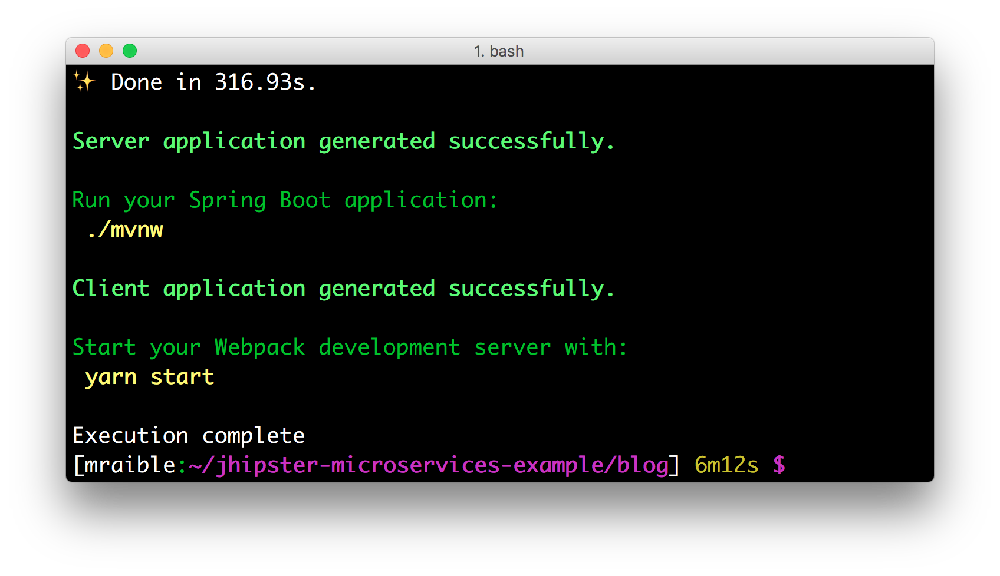

Before you can run this project, you'll need to download and start a instance of the [JHipster Registry](https://github.com/jhipster/jhipster-registry).

```bash
git clone git@github.com:jhipster/jhipster-registry.git registry
cd registry && mvn
```

The [JHipster Registry](https://jhipster.github.io/microservices-architecture/#jhipster-registry) is built on Spring 
Cloud Netflix and Spring Cloud Config. Patterns provided by Spring Cloud Netflix include Service Discovery (Eureka),  
Circuit Breaker (Hystrix), Intelligent Routing (Zuul), and Client Side Load Balancing (Ribbon). 

Run `./mvnw` to start the blog application and navigate to <http://localhost:8080> in your favorite browser. The first 
thing you'll notice is a dapper-looking fellow explaining how you can sign in or register.

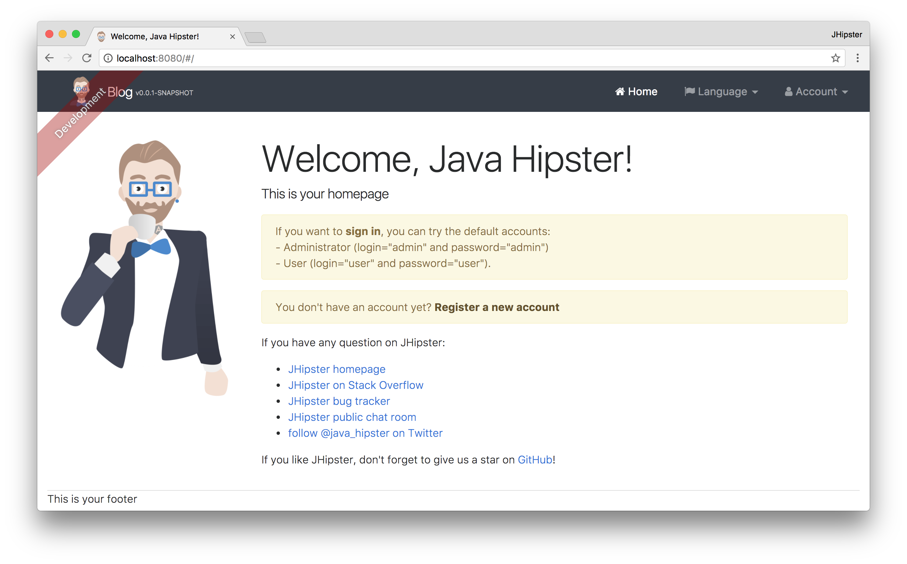

Sign in with username `admin` and password `admin` and you'll have access to navigate through the Administration section. 
This section offers nice looking UIs on top of some Spring Boot's many monitoring and configuration features. It also 
allows you to administer users:

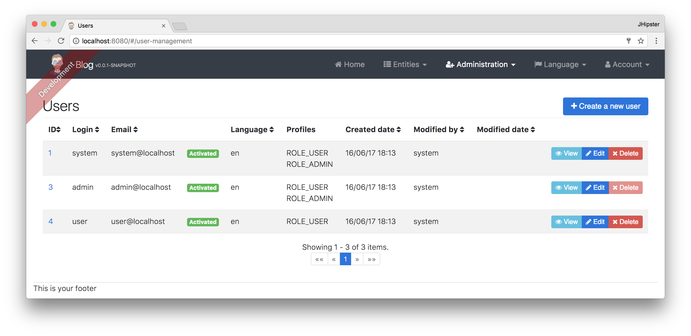

It gives you insights into Application and JVM metrics:

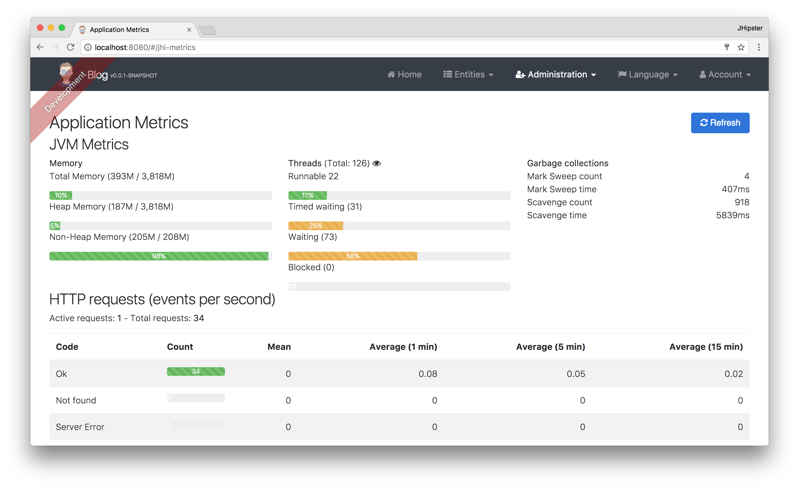

And it allows you to see the Swagger docs associated with its API.

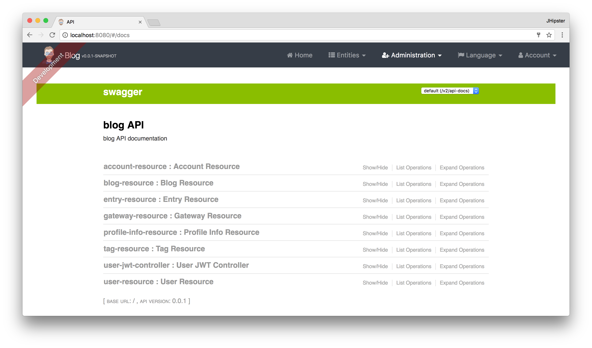

You can run the following command (in a separate terminal window) to run the Protractor tests and confirm everything is 
working properly.

```bash
yarn e2e
```

At this point, it's a good idea to check your project into Git so you can easily see what changes are made going forward.

```bash
git init
git add .
git commit -m "Gateway created"
```

### Generate Entities

For each entity you want to create, you will need:

* a database table;
* a Liquibase change set;
* a JPA entity class;
* a Spring Data `JpaRepository` interface;
* a Spring MVC `RestController` class;
* an Angular model, state, component, dialog components, service; and
* several HTML pages for each component.

In addition, you should have integration tests to verify that everything works and performance tests to verify that it 
runs fast. In an ideal world, you'd also have unit tests and integration tests for your Angular code.

The good news is JHipster can generate all of this code for you, including integration tests and performance tests. In 
addition, if you have entities with relationships, it will generate the necessary schema to support them (with foreign 
keys), and the TypeScript and HTML code to manage them. You can also set up validation to require certain fields as well as control their length.

JHipster supports several methods of code generation. The first uses its [entity sub-generator](https://jhipster.github.io/creating-an-entity/). 
The entity sub-generator is a command-line tool that prompts you with questions which you answer. 
[JDL-Studio](https://jhipster.github.io/jdl-studio/) is a browser-based tool for defining your domain model with JHipster 
Domain Language (JDL). Finally, [JHipster-UML](https://jhipster.github.io/jhipster-uml/) is an option for those that like UML. 
Supported UML editors include [Modelio](https://www.modeliosoft.com/), [UML Designer](http://www.umldesigner.org/), 
[GenMyModel](https://www.genmymodel.com/), and [Visual Paradigm](http://www.visual-paradigm.com/). I like the visual 
nature of JDL-Studio, so I'll use it for this project.

Below is the entity diagram and JDL code needed to generate a simple blog with blogs, entries and tags.

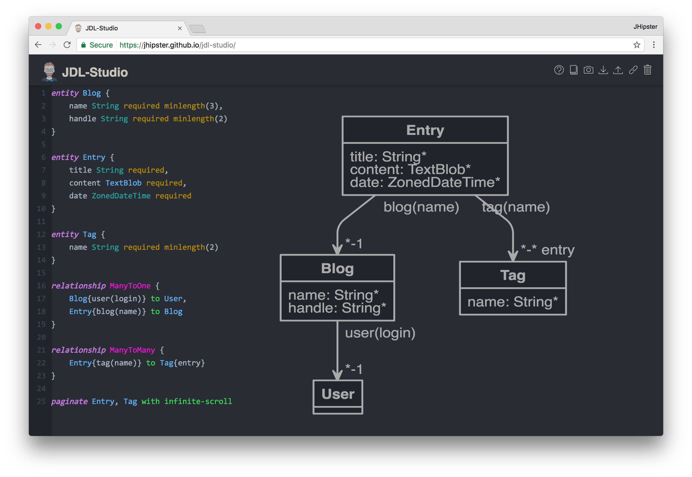

You can [click on this URL](http://bit.ly/jhipster4-blog-jdl), or copy/paste the contents of the file below to your hard 
drive if you'd like to follow along.

```
entity Blog {
	name String required minlength(3),
	handle String required minlength(2)
}

entity Entry {
	title String required,
	content TextBlob required,
	date ZonedDateTime required
}

entity Tag {
	name String required minlength(2)
}

relationship ManyToOne {
	Blog{user(login)} to User,
	Entry{blog(name)} to Blog
}

relationship ManyToMany {
	Entry{tag(name)} to Tag{entry}
}

paginate Entry, Tag with infinite-scroll
```

Run the following command (in the `blog` directory) to import this file. Running this command will generate entities, tests, and a UI.

```bash
yo jhipster:import-jdl ~/Downloads/jhipster-jdl.jh
```

You'll be prompted to overwrite `src/main/resources/config/liquibase/master.xml`. Type `a` to overwrite this file, as 
well as others.

**WARNING:** There is [a bug](https://github.com/jhipster/generator-jhipster/issues/5634) in JHipster 4.3.0 where it 
generates a file upload field instead of a `<textarea>` for the `entry.content` field. To fix this, edit 
`.jhipster/Entry.json` and add `"fieldTypeBlobContent": "text"` to the  properties for the `content` field. After your 
changes, it should look as follows:

```json
{
    "fieldName": "content",
    "fieldType": "byte[]",
    "fieldTypeBlobContent": "text",
    "fieldValidateRules": [
        "required"
    ]
},
```

Re-generate this entity by running `yo jhipster:entity entry`. If you're using a version greater than 4.3.0, this issue
is likely fixed.

Start the application with `/.mvnw` and run `yarn start` to view the UI for the generated entities. Create a couple 
blogs for the existing `admin` and `user` users, as well as a few blog entries.

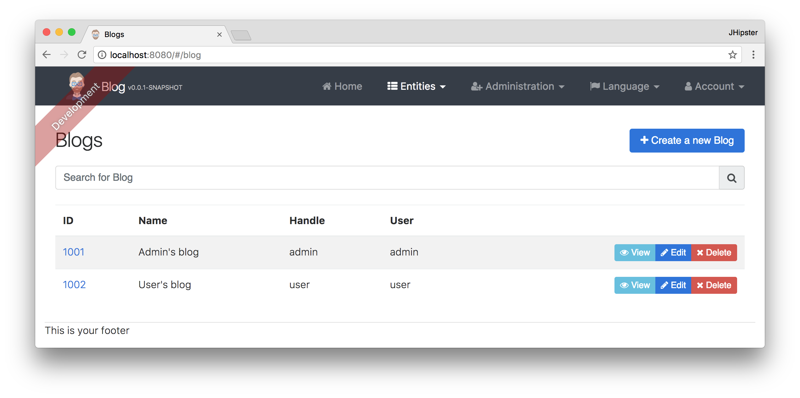

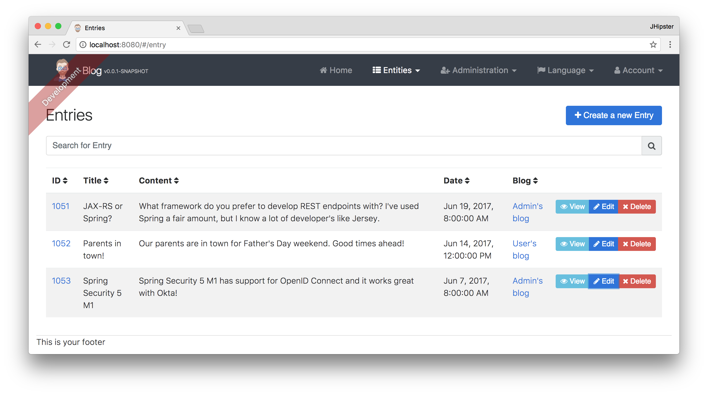

From these screenshots, you can see that users can see each other's data, and modify it.

Check your generated entities into Git.

```bash
git init
git add .
git commit -m "Entities generated"
```

### Add Business Logic

TIP: To configure an IDE with your JHipster project, see [Configuring your IDE](https://jhipster.github.io/configuring-ide/). 
Instructions exist for Eclipse, IntelliJ IDEA, Visual Studio Code, and NetBeans.

To add more security around blogs and entries, open `BlogResource.java` and find the `getAllBlogs()` method. Change the 
following line:

```java
List<Blog> blogs = blogRepository.findAll();
```

To:

```java
List<Blog> blogs = blogRepository.findByUserIsCurrentUser();
```

The `findByUserIsCurrentUser()` method is generated by JHipster in the `BlogRepository` class and allows limiting results 
by the current user.

```java
public interface BlogRepository extends JpaRepository<Blog,Long> {

    @Query("select blog from Blog blog where blog.user.login = ?#{principal.username}")
    List<Blog> findByUserIsCurrentUser();

}
```

After making this change, re-compiling `BlogResource` should trigger a restart of the application thanks to 
[Spring Boot's Developer tools](http://docs.spring.io/spring-boot/docs/current/reference/html/using-boot-devtools.html). 
If you navigate to <http://localhost:9000/blogs>, you should only see the blog for the current user.

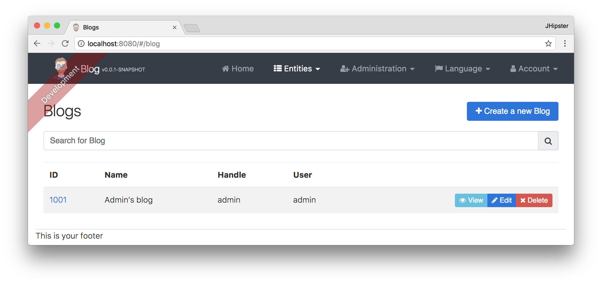

To add this same logic for entries, open `EntryResource.java` and find the `getAllEntries()` method. Change the following line:

```java
Page<Entry> page = entryRepository.findAll(pageable);
```

To:

```java
Page<Entry> page = entryRepository.findByBlogUserLoginOrderByDateDesc(SecurityUtils.getCurrentUserLogin(), pageable);
```

Using your IDE, create this method in the `EntryRepository` class. It should look as follows:

```java
Page<Entry> findByBlogUserLoginOrderByDateDesc(String currentUserLogin, Pageable pageable);
```

Recompile both changed classes and verify that the `user` user only sees the entries you created for them.

[User's entries](static/entries-user.png)

After making this changes, commit them to Git.

```
git add .
git commit -m "Add business logic"
```

You might notice that this application doesn't look like a blog and it doesn't allow HTML in the content field.

### Make UI Enhancements

When doing UI development on a JHipster-generated application, it's nice to see your changes as soon as you save a file. 
JHipster 4 uses [Browsersync](https://www.browsersync.io/) and [webpack](https://webpack.github.io/) to power this feature. 
You enable this previously by running the following command in the `blog` directory.

```bash
yarn start
```

In this section, you'll change the following:

1. Change the rendered content field to display HTML
2. Change the list of entries to look like a blog

#### Allow HTML

If you enter HTML in the `content` field of a blog entry, you'll notice it's escaped on the list screen.


To change this behavior, open `entry.component.html` and change the following line:

```html
<td>{{entry.content}}</td>
```

To:

```html
<td [innerHTML]="entry.content"></td>
```

After making this change, you'll see that the HTML is no longer escaped.

[HTML in entries](static/entries-with-html.png)

#### Improve the layout

To make the list of entries look like a blog, replace `<div class="table-responsive">` with HTML so it uses a stacked layout in a single column.

```html
<div class="table-responsive" *ngIf="entries">
    <div infinite-scroll (scrolled)="loadPage(page + 1)" [infiniteScrollDisabled]="page >= links['last']"
         [infiniteScrollDistance]="0">
        <div *ngFor="let entry of entries; trackBy: trackId">
            <h2>{{entry.title}}</h2>
            <small>Posted on {{entry.date | date: 'short'}} by {{entry.blog.user.login}}</small>
            <div [innerHTML]="entry.content"></div>
            <div class="btn-group mb-4 mt-1">
                <button type="submit"
                        [routerLink]="['/', { outlets: { popup: 'entry/'+ entry.id + '/edit'} }]"
                        replaceUrl="true"
                        class="btn btn-primary btn-sm">
                    <span class="fa fa-pencil"></span>
                    <span class="hidden-md-down" jhiTranslate="entity.action.edit">Edit</span>
                </button>
                <button type="submit"
                        [routerLink]="['/', { outlets: { popup: 'entry/'+ entry.id + '/delete'} }]"
                        replaceUrl="true"
                        class="btn btn-danger btn-sm">
                    <span class="fa fa-remove"></span>
                    <span class="hidden-md-down" jhiTranslate="entity.action.delete">Delete</span>
                </button>
            </div>
        </div>
    </div>
</div>
```

Now it looks more like a regular blog!

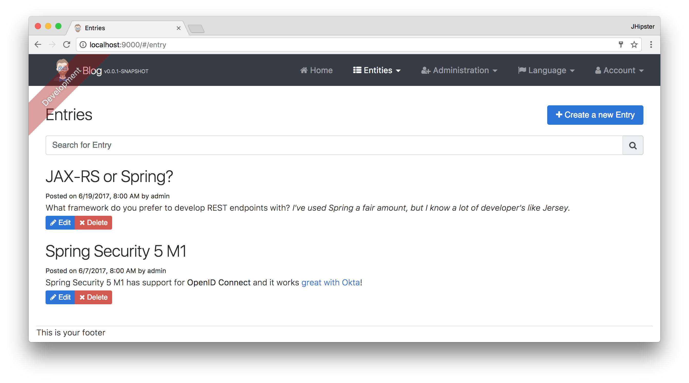

Commit all your changes to Git.

```
git add .
git commit -m "UI enhancements"
```

## Create a Microservice

To generate a `store` microservice, open a terminal window and navigate to the `jhipster-microservices-example` directory.
Create a `store` directory and run `yo jhipster` in it. Use the following settings to generate a microservice that uses 
MongoDB for its database.

* Application type: `Microservice application`
* Base name of the application: `store`
* Install other generators from the JHipster Marketplace: `No`
* Port: `8081`
* Default package name: `org.jhipster.store`
* Type of authentication: `JWT`
* Service Discovery and Configuration: `JHipster Registry`
* Type of database: `MongoDB`
* Maven or Gradle: `Maven`
* Other technologies: `None`
* Internationalization support: `Yes`
* Native language: `English`
* Additional languages: `Spanish`
* Testing frameworks: `Gatling`


Commit your changes to Git. It's always a good idea to do this before generating entities.

```bash
git commit -a -m "Generated store application"
```

### Generate Product Entity

Create a product entity by running the following command in the `store` directory.

```bash
yo jhipster:entity product
```

Use the following answers for the questions asked:

* Do you want to add a field to your entity? `Yes`
* What is the name of your field? `name`
* What is the type of your field? `String`
* Do you want to add validation rules to your field? `Yes`
* Which validation rules do you want to add? `Required`

* Do you want to add a field to your entity? `Yes`
* What is the name of your field? `price`
* What is the type of your field? `BigDecimal`
* Do you want to add validation rules to your field? `Yes`
* Which validation rules do you want to add? `Required`

* Do you want to add a field to your entity? `No`

* Do you want to use a Data Transfer Object (DTO)? `No`
* Do you want to use separate service class for your business logic? `No`
* Do you want pagination on your entity? `Yes, with pagination links`

Your terminal should look similar to the following after you've answered all these questions.


### Generate UI for Product Entity

A microservice only contains the server-side code for the entities it contains. To generate
an Angular UI for the product, navigate to the `blog` directory and run the same command.

```bash
yo jhipster:entity product
```

Use the following answers for the questions asked:

* Do you want to generate this entity from an existing microservice? `Yes`
* Enter the path to the microservice root directory: `../store`
* Do you want to update the entity? `Yes`

A visual of these questions and answers is in the screenshot below.


Commit your changes to Git.

```
git commit -a -m "Add product entity"
```

At this point, you should be able to verify everything works by starting the registry, blog, store, and MongoDB.
You can run MongoDB using Docker Compose and the following command in the `store` directory.

```bash
docker-compose -f src/main/docker/mongodb.yml up
```

The [Docker Compose](#docker-compose) section shows how you can run all your services using Docker.

Navigate to `http://localhost:8080`, login with admin/admin, and go to Entities > Product. You should be able to
add a product and see that it has a MongoDB identifier.

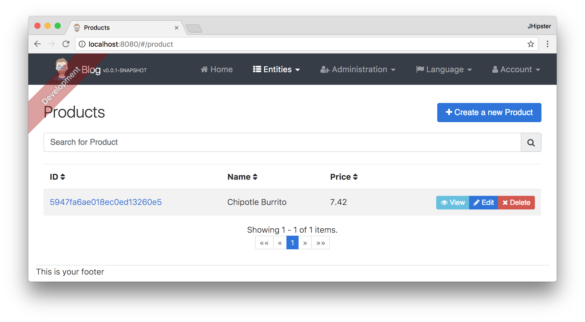

## Build for Production

A JHipster application can be deployed anywhere a Spring Boot application can be deployed. Its Angular client is
bundled inside its JAR files

JHipster ships with support for deploying to [Cloud Foundry](https://jhipster.github.io/cloudfoundry/), 
[Heroku](https://jhipster.github.io/heroku/), [Kubernetes](https://jhipster.github.io/kubernetes/), 
[AWS](https://jhipster.github.io/aws/), and [AWS with Boxfuse](https://jhipster.github.io/boxfuse/). 

When you prepare a JHipster application for production, it's recommended to use the pre-configured "`production`" profile. 
With Maven, you can package your application by specifying the `prod` profile when building.

```bash
mvn -Pprod package
```

The production profile is used to build an optimized JavaScript client. You can invoke this using webpack by running 
`yarn run webpack:prod`. The production profile also configures gzip compression with a servlet filter, cache headers, 
and monitoring via [Metrics](https://github.com/dropwizard/metrics). If you have a [Graphite](http://graphite.wikidot.com/) 
server configured in your `application-prod.yaml` file, your application will automatically send metrics data to it.

When you run this command in the `blog` application, you'll likely get a test failure.

```
Results :

Tests in error:
  BlogResourceIntTest.getAllBlogs:171 » NestedServlet Request processing failed;...

Tests run: 62, Failures: 0, Errors: 1, Skipped: 0
```

The reason this happens is shown in a stack trace in your terminal

```
getAllBlogs(org.jhipster.web.rest.BlogResourceIntTest)  Time elapsed: 0.041 sec  <<< ERROR!
org.springframework.web.util.NestedServletException: Request processing failed; nested exception is
org.springframework.dao.InvalidDataAccessApiUsageException: Authentication object cannot be null;
nested exception is java.lang.IllegalArgumentException: Authentication object cannot be null
```

To fix this, you can use Spring Security Test's [`@WithMockUser`](http://docs.spring.io/spring-security/site/docs/current/reference/html/test-method.html#test-method-withmockuser). Open `BlogResourceIntTest.java` and inject  `UserRepository` as a dependency.

```java
@Autowired
private UserRepository userRepository;
```

Change the `createEntity()` method so it's not `static` and uses the `userRepository` to set a user on the blog entity.

```java
public Blog createEntity(EntityManager em) {
    Blog blog = new Blog()
            .name(DEFAULT_NAME)
            .handle(DEFAULT_HANDLE)
            .user(userRepository.findOneByLogin("user").get());
    return blog;
}
```

Add `@WithMockUser` to the `getAllBlogs()` method.

```java
@Test
@Transactional
@WithMockUser
public void getAllBlogs() throws Exception {
```

After fixing this test, you should be able to run `mvn -Pprod package` without any failures. You might notice that
this does take quite some time, mostly due to the Webpack build and optimizations. Below is the output from a Mid 2015
MacBook Pro with 16GB of RAM and JAVA_OPTS set to `-Xmx2048m`.

```bash
[INFO] ------------------------------------------------------------------------
[INFO] BUILD SUCCESS
[INFO] ------------------------------------------------------------------------
[INFO] Total time: 05:11 min
[INFO] Finished at: 2017-05-03T08:54:41-06:00
[INFO] Final Memory: 88M/805M
[INFO] ------------------------------------------------------------------------
```

## Deploy to the Cloud

What good is a microservices architecture if it's not deployed to a PaaS (Platform as a Service)? PaaS providers
are also known as "the cloud", and allow you to easily deploy and scale microservices as needed. Docker provides
a mechanism to "package" your applications as an entire bundle. A Docker container includes the operating system and 
services needed to run your application. Often, Docker containers are used for the individual components of your 
architecture. For example, you'll have a Docker container for each app, as well as one for PostgreSQL, MongoDB, and
Elasticsearch.

To complete this section, you'll need to [install Docker](https://docs.docker.com/engine/installation/).

**NOTE:** If you're not on Mac or Windows, you may need to [install Docker Compose](https://docs.docker.com/compose/install/) as well.

<a name="docker-compose"></a>
### Docker Compose

Docker Compose is a tool for defining and running multi-container Docker applications. With Compose, you can create and 
start all the components of your application with a single command.

1. Make sure Docker is running.
2. Build Docker images for the `blog` and `store` applications by running the following command in both directories:

    ```
    mvn package -Pprod docker:build
    ```
    
3. Using your terminal, navigate to the root directory of your project, and create a `docker` directory. Then run the 
following command in it.

    ```
    yo jhipster:docker-compose
    ````
    
    * Application type: `Microservice application`
    * Root directory of your microservices: `../`
    * Applications to include: `blog` and `store`
    * Applications with clustered databases: `None`
    * Setup monitoring: `JHipster Console with ELK/Zipkin`
    * The admin password for the JHipster Registry: `admin`
    
    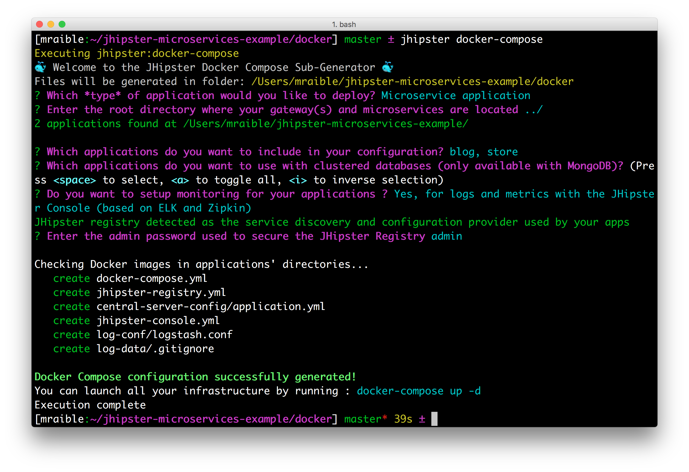
    
4. Run `docker-compose up` to run all your services and see the logs in the same window. Add `-d` if you want to run 
them as a daemon.
    
5. Use [Kitematic](https://kitematic.com/) to view the ports and logs for the services deployed.


You can view the JHipster Registry at <http://localhost:8761>.

To produce data for the JHipster Console to display, run some Gatling tests in the `blog` app.

```bash
mvn gatling:execute
```

These simulations can take a while (> 10m) to complete. When they're finished, you can view their pretty reports.


You can view the JHipster Console at <http://localhost:5601>. Navigate to Dashboards > Open to view some pre-built
dashboards for the JVM, logs, metrics, microservices, and performance. The screenshots below show you what some of 
these look like.

<table style="width: 100%">
<tr>
<td><a href="static/dashboard-jvm.png"></a></td>
<td><a href="static/dashboard-microservices.png"></a></td>
<td><a href="static/dashboard-performance.png"></a></td>
</tr>
</table>

To save your changes for Kubernetes, commit your changes to Git.

```
git commit -a -m "Add Docker Compose"
```

### Kubernetes 

[Kubernetes](https://kubernetes.io/) is an open-source system for automating deployment, scaling, and management of 
containerized applications. It was developed at Google over the last 16 years and was internally called Borg. To deploy
Docker containers with Kubernetes, you setup a cluster, then deploy to it. The context can be local (with Minikube), or 
remote (e.g. a Raspberry Pi cluster, Google Cloud, AWS, OpenShift, etc.).

Follow the steps below to use Kubernetes to deploy to a local cluster.


1. Install [kubectl](https://kubernetes.io/docs/tasks/kubectl/install/) and [Minikube](https://github.com/kubernetes/minikube/releases).
2. Start Minikube using `minikube start`.
3. To be able to work with the docker daemon, make sure Docker is running, then run the following command in your terminal:

    ```bash
    eval $(minikube docker-env)
    ```

4. Using your terminal, navigate to the root directory of your project, and create a `kubernetes` directory. Then run the 
following command in it.

    ```
    yo jhipster:kubernetes
    ````
    
    * Application type: `Microservice application`
    * Root directory of your microservices: `../`
    * Applications to include: `blog` and `store`
    * Applications with clustered databases: `None`
    * Setup monitoring: `JHipster Console with ELK/Zipkin`
    * The admin password for the JHipster Registry: `admin`
    
    
    
4. Create Docker images of the `blog` and `store` applications:

   ```bash
   mvn package -Pprod docker:build
   ```
  
  
5. Modify `kubernetes/blog/blog-deployment.yml` to add `imagePullPolicy: IfNotPresent`.

    ```
    image: blog
    imagePullPolicy: IfNotPresent
    ```

6. Modify `kubernetes/store/store-deployment.yml` to add `imagePullPolicy: IfNotPresent`.

    ```
    image: store
    imagePullPolicy: IfNotPresent
    ```
    
7. Run the following commands in the `kubernetes` directory to deploy to Minikube. Run `minikube dashboard` to see the deployed containers.

    ```
    kubectl apply -f registry
    kubectl apply -f blog
    kubectl apply -f store
    ```

9. Run `minikube service blog` to view the blog application. You can also run `kubectl get po -o wide --watch` to see the status of each pod.

To remove all deployed containers, run the following command:

    kubectl delete deployment --all

If you run `minikube delete` and have trouble running `minikube start` afterward, run `rm -rf ~/.minikube`. See [this issue](https://github.com/kubernetes/minikube/issues/290) for more information.


## Learn More

I hope you've enjoyed learning how JHipster can help you develop hip web applications! It's a nifty project, with an easy-to-use entity generator, a pretty UI and many Spring Boot best-practice patterns. The project team follows five simple https://jhipster.github.io/policies/[policies], paraphrased here:

1. The development team votes on policies.
2. JHipster uses technologies with their default configurations as much as possible.
3. Only add options when there is sufficient added value in the generated code.
4. For the Java code, follow the default IntelliJ IDEA formatting and coding guidelines.
5. Use strict versions for third-party libraries.

These policies help the project maintain its sharp edge and streamline its development process. If you have features you'd like to add or if you'd like to refine existing features, you can https://github.com/jhipster/generator-jhipster[watch the project on GitHub] and https://github.com/jhipster/generator-jhipster/blob/master/CONTRIBUTING.md[help with its development] and support. We're always looking for help!

Now that you've learned how to use Angular, Bootstrap 4, and Spring Boot with JHipster, go forth and develop great applications!

## Source Code

The source code for this project is available on GitHub at https://github.com/mraible/jhipster4-demo.
